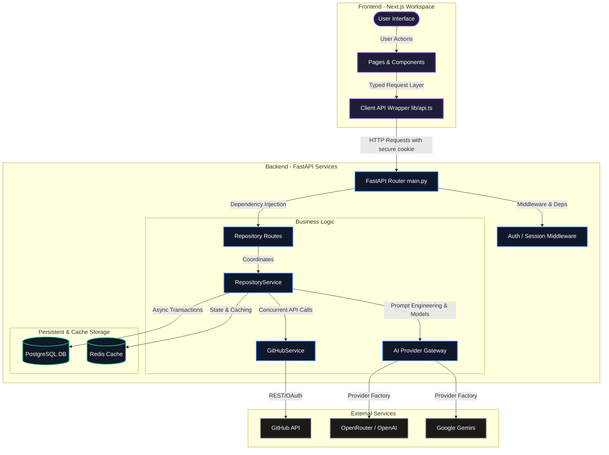
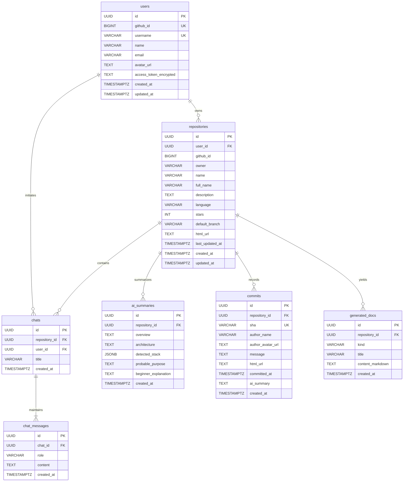
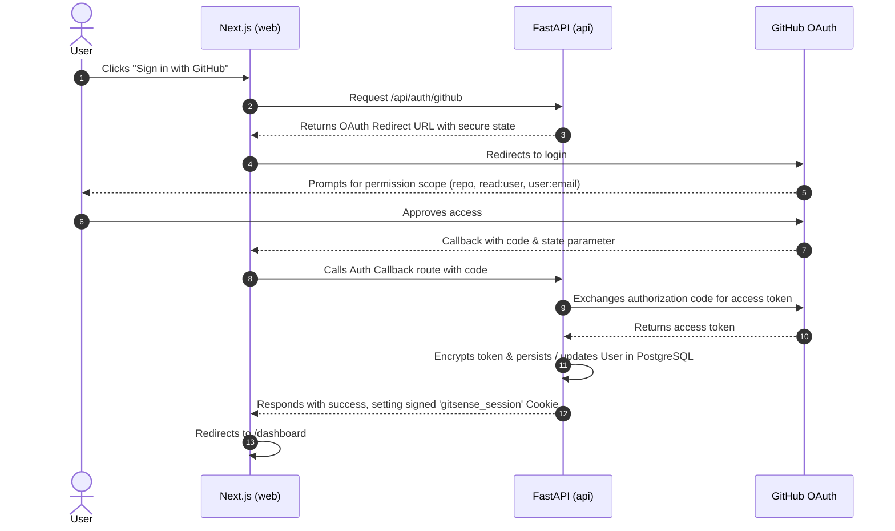
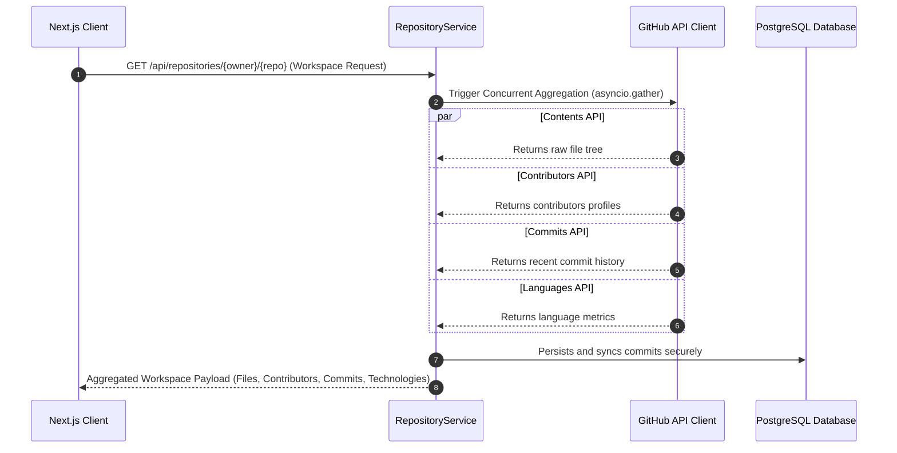

# GitSense Architecture & Implementation Guide

GitSense is a premium, AI-powered developer cockpit designed for deep codebase comprehension, commit intelligence, interactive context-aware chats, and on-demand documentation generation. This document provides a highly detailed, professional overview of the system architecture, component boundaries, database schemas, and principal data flows.

---

## 1. High-Level System Architecture

GitSense is built on a clean **Client-Server split** with a Next.js frontend and a FastAPI backend. It utilizes PostgreSQL for persistent relational storage, Redis for fast cache operations, GitHub OAuth for identity and repository permissions, and a modular AI interface to interact with language models (LLMs).



---

## 2. Component Design & Directory Mapping

The codebase is organized as a monorepo featuring distinct application directories:

```text
gitsense/
├── apps/
│   ├── api/                      # FastAPI Backend
│   │   ├── alembic/              # Database migration environments
│   │   └── app/
│   │       ├── api/
│   │       │   └── routes/       # Auth, Health, Repositories routers
│   │       ├── core/             # Configurations, settings, dependency logic
│   │       ├── db/               # SQLAlchemy Session and engine configuration
│   │       ├── models/           # SQLAlchemy DB models mapping to schema.sql
│   │       ├── schemas/          # Pydantic input/output validation models
│   │       ├── services/         # Core operational services (AI, GitHub, Repository)
│   │       └── main.py           # Application lifespan and CORS setup
│   └── web/                      # Next.js Frontend
│       ├── app/                  # App Router: auth, dashboard, repositories pages
│       ├── components/           # Core Layouts and custom Radix-style UI Components
│       └── lib/
│           └── api.ts            # Highly typed client library and API abstractions
└── infra/
    └── schema.sql                # Relational SQL blueprint of the system
```

---

## 3. Database Schema Blueprint

GitSense stores relational metadata, cached repository commits, files structure, user preferences, and AI summaries in a structured **PostgreSQL database**. 



> [!NOTE]
> Database models are defined using **SQLAlchemy Async declarative mappings** inside `apps/api/app/models/`. Cryptographic functions (`cryptography.fernet`) securely encrypt user access tokens before persistence, guaranteeing secret isolation.

---

## 4. Fundamental System Flows

### A. Authentication and Callback Flow

GitSense uses **GitHub OAuth** for user authentication and repository access integration.



### B. High-Performance Repository Sync Flow

GitSense implements concurrent data pipeline ingestion to speed up synchronization times.



---

## 5. Modular AI Provider Gateway

The backend abstraction layer enables switching LLM engines seamlessly while providing reliable error management.

### Architecture Structure

* **`AIProvider` (Base Interface)**: Defines the standard operations required by GitSense:
  * `repository_summary(context)`
  * `chat(context, question)`
  * `commit_intelligence(context)`
  * `readme(context)`
* **`GeminiService`**: Custom service integration translating calls directly into native Gemini formats using Google Gemini credentials.
* **`OpenAIService`**: Universal adapter accommodating both official **OpenAI** engines and aggregate portals like **OpenRouter**.
* **`DisabledAIService`**: A robust fallback system ensuring features fail gracefully into structured placeholder states if no active API credentials are provided.

### Prompt Context Construction

When a workflow runs, GitSense gathers high-fidelity repository context:
1. **Directory Tree**: Up to 80 structured file path nodes.
2. **Top Contributors**: Up to 20 contributor profiles and metrics.
3. **Commit Stream**: Top 20 chronological commits.
4. **Targeted Code Context**: Up to 5 user-selected files with full code body strings.

---

## 6. Premium Dark-Mode User Interface

The Next.js client layout features a premium dashboard styled around modern dark mode design:

1. **Workspace Tabs Layout**:
   * **Overview**: Interactive files navigation list grouped with contributors avatars and live language pills.
   * **Codebase Chat**: Interactive dialogue bubble utilizing sliding micro-animations and quick onboarding chip prompts.
   * **Commits**: In-depth commit analysis engine containing summaries of recent codebase events.
   * **Docs**: Interactive README.md compiler providing one-click copy features.
2. **Glassmorphism Styling**: Uses custom background filters (`glass-strong`) and dynamic borders alongside visual micro-animations (`animate-float`, `animate-glow-pulse`, `animate-slide-up`).
